# Relatório — Lab01: Características de Repositórios Populares

## Sumário

- [1. Introdução e hipóteses informais](#1-introdução-e-hipóteses-informais)
- [2. Metodologia de coleta](#2-metodologia-de-coleta)
- [3. Resultados e discussão por RQ](#3-resultados-e-discussão-por-rq)
- [4. Configuração do processo (GitHub Projects)](#4-configuração-do-processo-github-projects)

Link do repositório/GitHub Projects do grupo: `https://github.com/luisajardim/Lab-Experimentacao-e-Medicao-`

---

## 1. Introdução e hipóteses informais

As hipóteses abaixo foram escritas antes de olharmos qualquer dado coletado —
a ideia é justamente poder comparar depois o que a gente imaginava com o que
os números de fato mostraram.

**RQ01 — Sistemas populares são maduros/antigos?**
A gente acha que sim. É difícil um repositório juntar milhares de estrelas de
um dia pro outro; isso normalmente vem de anos ganhando visibilidade e sendo
recomendado dentro da comunidade. Por isso esperamos ver poucos repositórios
com menos de um ou dois anos entre os mais estrelados, e bastante coisa
concentrada na faixa de 5 a 15 anos. Quando aparecer algum caso recente no
topo, imaginamos que seja algo que viralizou rápido ou pegou muita divulgação
de uma vez.

*Depois do dataset completo (Issues #8 e #9):* a hipótese se sustentou quase
sem ajuste. A única coisa que mudaria na redação é chamar os repositórios
jovens de "exceção" — os 13,9% com menos de 2 anos não aparecem como outlier
em nenhum teste estatístico (critério IQR), então não são um caso anômalo
isolado, são só a ponta mais nova de uma distribuição contínua, puxada
provavelmente pela onda de ferramentas de IA/agentes de código que surgiu em
2025-2026.

**RQ02 — Sistemas populares recebem muita contribuição externa?**
Hipótese: Sim. Repositórios com muitas estrelas tendem a ter uma comunidade
maior e mais visibilidade, o que deve atrair contribuições na forma de pull
requests. Assim, esperamos que a maior parte dos repositórios populares possua
uma quantidade relevante de PRs aceitas, embora alguns projetos muito grandes
possam concentrar valores excepcionalmente altos.

**RQ03 — Sistemas populares lançam releases com frequência?**
Hipótese: Sim, para uma parcela expressiva. Projetos populares normalmente
precisam comunicar versões, correções e novas funcionalidades aos usuários, então
esperamos encontrar um histórico relevante de releases. Porém, espera-se também que
alguns repositórios não usem a funcionalidade Releases do GitHub, por exemplo,
projetos que distribuem versões apenas por tags, pacotes ou imagens de containers.

**RQ04 — Sistemas populares são atualizados com frequência?**
Achamos que sim, na maioria dos casos — mais visibilidade costuma trazer mais
gente contribuindo e, com isso, mais manutenção acontecendo. Mas também
esperamos um grupo menor de repositórios que continuam populares mesmo sem
receber atualização recente: coisas como listas `awesome-*`, materiais
educacionais ou ferramentas que já chegaram num ponto de maturidade e não
precisam mudar com frequência.

*Depois do dataset completo (Issues #8 e #9):* a parte da frequência se
confirmou até mais forte do que a gente esperava — a mediana real é de 2 dias,
bem mais rápido que o "dias/semanas" que tínhamos chutado. Já o segundo grupo
precisou de correção: não é principalmente lista `awesome-*` ou material
educacional como imaginamos. Olhando os 196 outliers (critério IQR, 19,6% do
dataset), os casos mais extremos são sobretudo ferramentas de software
descontinuadas oficialmente — `atom/atom`, que o GitHub parou de manter em
2022, e `adobe/brackets`, encerrado pela Adobe, são bons exemplos. Ou seja: o
grupo "estagnado" tem mais a ver com produto abandonado pelos mantenedores do
que com conteúdo que naturalmente não muda.

**RQ05 — Sistemas populares são escritos nas linguagens mais populares?**
Hipótese: Sim. Usando o **GitHub Octoverse 2025** como referência única de
popularidade de linguagens (TypeScript, Python e JavaScript no topo),
esperamos que a maior parte dos repositórios mais estrelados tenha uma
dessas linguagens como `primaryLanguage`.

**RQ06 — Sistemas populares possuem um alto percentual de issues fechadas?**
Hipótese: Sim. Projetos com muitas estrelas tendem a ter comunidade e
automação suficientes para triagem contínua. Esperamos mediana da razão
`issues fechadas / total de issues` acima de 0,7 (70%). Repositórios sem
aba de Issues (ex.: alguns kernels) entram com razão 0 e não são excluídos.

**RQ07 — Sistemas em linguagens mais populares recebem mais contribuição externa, lançam mais releases e são atualizados com mais frequência?**
Hipótese: Sim. Esperamos medianas maiores de PRs aceitas (RQ02) e de
releases (RQ03), e mediana menor de dias desde o último push (RQ04), nos
repositórios cuja linguagem está no top do Octoverse 2025, em comparação
com as demais linguagens da amostra.

---

## 2. Metodologia de coleta

A coleta é feita pelo subprojeto `Miner`, que consulta a API GraphQL do
GitHub a partir de especificações declarativas (arquivos `.yaml` em
`Miner/specs/`), sem depender de bibliotecas de terceiros para acessar a API —
a query é escrita e consumida por um script próprio do grupo, conforme exigido
no enunciado.

Na S01 cada integrante validou a extração da sua parte em amostra reduzida.
Na S02 o script único (`github-search-v1.yaml`) pagina até 1.000 repositórios
e exporta um CSV com todas as métricas das 7 RQs.

**RQ01 e RQ04** — usa a spec [`Miner/specs/github-rq1-rq4-v1.yaml`](Miner/specs/github-rq1-rq4-v1.yaml),
que extrai `createdAt` e `pushedAt` de cada repositório. Em cima disso,
`Miner/src/index.ts` calcula, no momento da coleta:
- `idade_anos` (RQ01): tempo entre `createdAt` e a data da coleta, em anos;
- `dias_desde_ultima_atualizacao` (RQ04): tempo entre `pushedAt` e a data da
  coleta, em dias.

Como rodar, como validamos manualmente e os detalhes da checagem de outliers
estão em [`Miner/docs/rq01-rq04.md`](Miner/docs/rq01-rq04.md).

**RQ05 / RQ06 / RQ07** — spec [`Miner/specs/github-search-v1.yaml`](Miner/specs/github-search-v1.yaml).
Extrai `primaryLanguage.name`, issues fechadas, total de issues, PRs merged,
releases e `pushedAt`.
- **Fonte de linguagens populares (RQ05/RQ07):** GitHub Octoverse 2025
  (https://octoverse.github.com/), ranking por contribuidores em agosto/2025:
  TypeScript, Python, JavaScript, Java, C#. Essa fonte é a única usada no lab.
- **RQ06:** `ratio_closed_issues = closed_issues / total_issues` (0 se não
  houver issues).
- **RQ07:** o CSV já concentra linguagem + métricas de RQ02, RQ03 e RQ04;
  o cruzamento estatístico fica para a S03.
Validação da amostra S01 e da fonte: [`Miner/docs/rq05-rq06-rq07.md`](Miner/docs/rq05-rq06-rq07.md).
Validação do CSV da S02: `npm run validate:rq05` → [`Miner/docs/rq05-rq06-validation-s02.md`](Miner/docs/rq05-rq06-validation-s02.md).

**RQ02 / RQ03** — usa a spec [`Miner/specs/github-rq2-rq3-v2.yaml`](Miner/specs/github-rq2-rq3-v2.yaml).
Ela busca `nameWithOwner`, `primaryLanguage.name`, o total de pull requests com
estado `MERGED` e o total de releases dos 1.000 repositórios ordenados por
estrelas.

O exportador padroniza os campos no CSV gerado:
- **RQ02 — `total_pr_aceitas`**: `pullRequests(states: MERGED).totalCount`;
- **RQ03 — `total_releases`**: `releases.totalCount`;
- valores nulos, ausentes ou inválidos em métricas numéricas são exportados como
  `0`, e as contagens são garantidas como inteiros não negativos;
- `data_coleta` registra o instante da coleta para rastreabilidade.

Para rodar:

```bash
npm run dev -- ./specs/github-rq2-rq3-v2.yaml
```

O CSV é salvo em `data/github-rq2-rq3-v2_<timestamp>.csv`.

---

## 3. Resultados e discussão por RQ

### RQ01 — Idade do repositório

Números calculados em cima do dataset completo, os 1.000 repositórios de
`Miner/data/1000_popular_repos.csv`:

| Métrica | Valor |
|---|---|
| Repositórios | 1.000 (0 valores ausentes em `idade_anos`) |
| Mínimo | 0,02 anos |
| 1º quartil (Q1) | 3,50 anos |
| Mediana | 7,74 anos |
| 3º quartil (Q3) | 11,35 anos |
| Máximo | 18,36 anos |
| Média | 7,66 anos |

Por faixa etária:

| Faixa | Repositórios |
|---|---|
| até 1 ano | 82 (8,2%) |
| 1-2 anos | 57 (5,7%) |
| 2-5 anos | 185 (18,5%) |
| 5-10 anos | 331 (33,1%) |
| 10-15 anos | 296 (29,6%) |
| 15+ anos | 49 (4,9%) |

Pra checar outliers usamos o critério de Tukey: `Q1 - 1,5×IQR` e
`Q3 + 1,5×IQR`, com IQR = 7,85 anos, dá uma faixa de aceitação de mais ou
menos −8,3 a 23,1 anos. Como a idade não passa de ~18 anos em nenhum caso (o
GitHub existe desde 2008) e não tem como ser negativa, nenhum repositório
ficou fora dessa faixa — zero outliers.

**Discussão:** a hipótese se confirma. Mediana em 7,74 anos e média bem
próxima (7,66) indicam uma distribuição sem grande distorção, com a maior
parte dos repositórios concentrada entre 5 e 15 anos (62,7% do total). Só
13,9% têm menos de 2 anos, o que reforça que popularidade no GitHub costuma
levar tempo pra se construir. E como não apareceu nenhum outlier, essa
maturidade parece ser mesmo a regra entre os repositórios mais populares, não
um efeito puxado por um punhado de projetos muito antigos.

### RQ02 — Contribuição externa

**Resultado:** o dataset auditado tem 1.000 registros válidos. A métrica
`total_pr_aceitas` teve mínimo de 0, Q1 de 175, mediana de 768, Q3 de 3.415,75,
média de 4.236,77 e máximo de 103.349. O critério de Tukey apontou 124
outliers, com IQR = 3.240,75 e limite superior ≈ 8.276,88; não houve nenhum
valor inválido em `total_pr_aceitas`.

Os maiores valores da amostra estão em projetos com comunidades muito grandes,
como `firstcontributions/first-contributions`, `llvm/llvm-project`,
`elastic/elasticsearch`, `getsentry/sentry` e `home-assistant/core`.

**Discussão:** a hipótese se confirma, mas com uma diferença importante: a
maioria dos repositórios populares recebe uma quantidade bastante relevante de
PRs aceitas, embora a distribuição seja extremamente desigual. A mediana de 768
PRs aceitos mostra que boa parte dos projetos tem um fluxo constante de
contribuição, e os valores extremos puxam a média para 4.236,77. Isso faz
sentido para projetos muito grandes, com comunidades ativas e unidades de
manutenção que processam centenas ou milhares de contribuições ao longo do
tempo. Em resumo, contribuição externa parece ser a regra entre os projetos
populares, mas a intensidade varia muito de um repositório para outro.

### RQ03 — Frequência de releases

**Resultado:** o mesmo CSV auditado de Q2 tem 1.000 registros válidos. A métrica
`total_releases` teve mínimo de 0, Q1 de 0, mediana de 39, Q3 de 147, média de
126,61 e máximo de 1.000. Houve 286 repositórios com zero releases (28,6%) e 93
outliers pelo critério de Tukey, com IQR = 147 e limite superior ≈ 367,50.

Entre os maiores históricos de releases figuram `langchain-ai/langchain`,
`vercel/next.js`, `ggml-org/llama.cpp`, `electron/electron` e
`storybookjs/storybook`.

**Discussão:** a hipótese se sustenta parcialmente. Há uma parcela importante
da amostra com histórico de versões — a mediana de 39 releases e o Q3 em 147
indicam que muitos repositórios populares lançam artefatos de forma regular.
Porém, 28,6% dos projetos não usam a funcionalidade de Releases do GitHub,
mesmo sendo populares, o que sugere que muitas versões são distribuídas por
meios alternativos, como tags, pacotes, imagens de contêiner ou canais de
entrega próprios. Também vale destacar que o número total de releases não mede
frequência diretamente, porque repositórios mais antigos tiveram mais tempo
para acumular lançamentos. Por isso, a melhor leitura é a mediana e a
distribuição da amostra, e não apenas os máximos absolutos.

### RQ04 — Tempo desde a última atualização

Mesma base de RQ1, os 1.000 repositórios:

| Métrica | Valor |
|---|---|
| Repositórios | 1.000 (0 valores ausentes em `dias_desde_ultima_atualizacao`) |
| Mínimo | 0 dias |
| 1º quartil (Q1) | 0 dias |
| Mediana | 2 dias |
| 3º quartil (Q3) | 48,25 dias |
| Máximo | 2.452 dias (~6,7 anos) |
| Média | 113,8 dias |

Por faixa:

| Faixa | Repositórios |
|---|---|
| até 1 dia | 477 (47,7%) |
| 2-7 dias | 132 (13,2%) |
| 8-30 dias | 118 (11,8%) |
| 31-90 dias | 64 (6,4%) |
| 91-365 dias | 94 (9,4%) |
| mais de 365 dias | 115 (11,5%) |

Aqui o IQR é 48,25 dias, o que dá um limite superior de aproximadamente 120,6
dias (`Q3 + 1,5×IQR`). Passando disso, 196 repositórios (19,6% do dataset)
entram como outliers — todos pra cima, já que não tem como um repositório
ficar "menos que zero" dias sem push. Os casos mais extremos:

| Repositório | Dias sem push |
|---|---|
| exacity/deeplearningbook-chinese | 2.452 |
| GitSquared/edex-ui | 1.765 |
| lib-pku/libpku | 1.688 |
| adobe/brackets | 1.529 |
| atom/atom | 1.324 |

Vale destacar `atom/atom` e `adobe/brackets`: são editores de código que o
GitHub e a Adobe descontinuaram oficialmente, mas que seguem com muitas
estrelas acumuladas mesmo sem receber commit há anos.

**Discussão:** a hipótese se confirma, e o segundo grupo previsto também
apareceu. A mediana de 2 dias mostra que quase metade dos repositórios
(47,7%) recebeu push no último dia — atividade praticamente diária. Mas a
média (113,8 dias) fica bem acima da mediana, o que denuncia uma distribuição
puxada por uma cauda longa de repositórios populares que pararam de ser
mantidos — os mesmos 19,6% que aparecem como outliers. Faz sentido: acumular
estrelas é algo que fica registrado, então um projeto pode continuar
"relevante" no GitHub muito tempo depois de os mantenedores terem abandonado
ele.

### RQ05 — Linguagem primária

**Resultado** (CSV de 1.000 repositórios, Sprint 2 —
`Miner/data/github-search-v1_1787150327459.csv`):

| Linguagem | Contagem | % |
|---|---:|---:|
| Python | 228 | 22,8% |
| TypeScript | 174 | 17,4% |
| JavaScript | 111 | 11,1% |
| Sem linguagem (N/A) | 87 | 8,7% |
| Go | 76 | 7,6% |
| Rust | 57 | 5,7% |
| C++ | 41 | 4,1% |
| Java | 41 | 4,1% |

Nas 5 linguagens do Octoverse 2025 (TypeScript, Python, JavaScript, Java, C#):
562 repositórios (56,2%).

**Discussão:** a hipótese se sustenta em parte. Python, TypeScript e JavaScript
são de fato as três linguagens primárias mais frequentes entre os mais
estrelados, alinhadas ao topo do Octoverse 2025. A ordem local, porém, não
copia o ranking de contribuidores: Python lidera a amostra (22,8%) enquanto
o Octoverse coloca TypeScript em 1º. Há ainda 8,7% sem linguagem definida
(listas `awesome-*`, materiais etc.), o que puxa o cruzamento para baixo se
não for tratado à parte.

### RQ06 — Percentual de issues fechadas

**Resultado** (mesmos 1.000 repositórios):

| Métrica | Valor |
|---|---|
| Razão mínima | 0,00 |
| Razão mediana | **0,8649 (86,5%)** |
| Razão máxima | 1,00 |
| Repositórios sem issues (total = 0) | 43 |
| Razão fora de [0, 1] | 0 |

**Discussão:** a mediana de ~86,5% supera o limiar de 70% da hipótese. Os
43 repositórios com razão 0 por não usarem a aba Issues (ex.: `torvalds/linux`
e várias listas) puxam o mínimo para 0, mas não derrubam a mediana. Não houve
inconsistência `closed_issues > total_issues` no CSV.

### RQ07 — Cruzamento por linguagem (RQ02, RQ03 e RQ04 por linguagem)

**Resultado:** a extração já está no CSV unificado (`linguagem`, `merged_prs`,
`releases`, `dias_desde_ultima_atualizacao`). Tabelas por linguagem entram na
S03 (análise e visualização), para não misturar hipótese informal com o
cruzamento final.

**Discussão:** hipótese registrada na seção 1; a confrontação com os números
fica para a S03, depois da validação do dataset de 1.000 repositórios.

---

## 4. Configuração do processo (GitHub Projects)

O board do grupo é um GitHub Projects (v2) vinculado ao repositório
`luisajardim/Lab-Experimentacao-e-Medicao-`. Cartões devem ser Issues com
Assignee (não draft solto). Colunas mínimas de Status: Backlog do Enunciado → Backlog da Sprint →
Em Andamento → Concluído.

**Snapshot de fechamento de sprint (requisito 6 / Issue #14):** ao final de
cada sprint rode, em `Enunciado 1/Miner`:

```bash
npm run snapshot
```

O script consulta o Project v2 via GraphQL (sem biblioteca cliente da API do
GitHub), pagina de 100 em 100 e grava CSV em `Miner/data/snapshots/`, além de
acumular as linhas em `Miner/data/snapshots/history.csv`. Variáveis:
`GITHUB_PROJECT_OWNER`, `GITHUB_PROJECT_NUMBER`, `GITHUB_PROJECT_OWNER_TYPE`,
`SPRINT_ID`. O PAT precisa do escopo `read:project` além da leitura de
repositórios públicos.

Política de WIP do kanban: o limite na coluna *Em Andamento* é de 3 cartões.
Esse teto reduz multitarefa, evita concentração excessiva de trabalho em
execução e força o grupo a terminar tarefas antes de puxar novas atividades.
Na prática, isso ajuda a manter o fluxo estável, expõe bloqueios mais cedo e
deixa o board mais previsível durante as sprints.

[preencher: print do kanban ao final da sprint 3]

---

## Apêndice A — GQM Tree do Projeto

```mermaid
graph TD
    G1["Goal 1:<br/>Caracterizar repositórios<br/>populares no GitHub"] --> Q1["Q1:<br/>São maduros/antigos?"]
    G1 --> Q2["Q2:<br/>Recebem contribuição externa?"]
    G1 --> Q3["Q3:<br/>Lançam releases?"]
    G1 --> Q4["Q4:<br/>São atualizados?"]
    G1 --> Q5["Q5:<br/>Linguagens mais populares?"]
    G1 --> Q6["Q6:<br/>Alto % issues fechadas?"]
    G1 --> Q7["Q7:<br/>Cruzamento linguagem x<br/>PRs, releases e atualização"]

    Q1 --> M11["M1.1<br/>idade_anos"]
    Q1 --> M12["M1.2<br/>faixa_etaria"]
    Q1 --> M13["M1.3<br/>outliers_idade"]

    Q2 --> M21["M2.1<br/>total_pr_aceitas"]
    Q2 --> M22["M2.2<br/>outliers_pr"]

    Q3 --> M31["M3.1<br/>total_releases"]
    Q3 --> M32["M3.2<br/>pct_zero_releases"]
    Q3 --> M33["M3.3<br/>outliers_releases"]

    Q4 --> M41["M4.1<br/>dias_desde_ultima_atualizacao"]
    Q4 --> M42["M4.2<br/>faixa_atividade"]
    Q4 --> M43["M4.3<br/>outliers_atividade"]

    Q5 --> M51["M5.1<br/>primaryLanguage"]
    Q5 --> M52["M5.2<br/>fonte_popularidade"]
    Q5 --> M53["M5.3<br/>contagem_por_linguagem"]
    Q5 --> M54["M5.4<br/>pct_no_top5_octoverse"]

    Q6 --> M61["M6.1<br/>ratio_closed_issues"]
    Q6 --> M62["M6.2<br/>mediana_ratio"]
    Q6 --> M63["M6.3<br/>repos_sem_issues"]

    Q7 --> M71["M7.1<br/>prs_por_linguagem"]
    Q7 --> M72["M7.2<br/>releases_por_linguagem"]
    Q7 --> M73["M7.3<br/>dias_por_linguagem"]
```



---

## Apêndice B — GQM Table do Projeto

<table border="1" cellspacing="0" cellpadding="6">
  <thead>
    <tr>
      <th>Goal</th>
      <th>Question (RQ/QG)</th>
      <th>Métrica (Código)</th>
      <th>Nome da métrica</th>
      <th>Descrição / Fórmula</th>
      <th>Artefato fonte</th>
    </tr>
  </thead>
  <tbody>
    <tr>
      <td rowspan="21"><strong>G1</strong> — Caracterizar repositórios populares no GitHub</td>
      <td rowspan="3"><strong>Q1</strong> — Sistemas populares são maduros/antigos?</td>
      <td>M1.1</td>
      <td><code>idade_anos</code></td>
      <td>Diferença em anos entre <code>createdAt</code> e a data da coleta</td>
      <td><code>Miner/specs/github-rq1-rq4-v1.yaml</code></td>
    </tr>
    <tr>
      <td>M1.2</td>
      <td><code>faixa_etaria</code></td>
      <td>Classificação: até 1 ano, 1-2, 2-5, 5-10, 10-15, 15+</td>
      <td><code>Miner/src/index.ts</code></td>
    </tr>
    <tr>
      <td>M1.3</td>
      <td><code>outliers_idade</code></td>
      <td>Repositórios fora de <code>[Q1 - 1,5×IQR, Q3 + 1,5×IQR]</code></td>
      <td>Cálculo pós-coleta</td>
    </tr>
    <tr>
      <td rowspan="2"><strong>Q2</strong> — Sistemas populares recebem muita contribuição externa?</td>
      <td>M2.1</td>
      <td><code>total_pr_aceitas</code></td>
      <td><code>pullRequests(states: MERGED).totalCount</code></td>
      <td><code>Miner/specs/github-rq2-rq3-v2.yaml</code></td>
    </tr>
    <tr>
      <td>M2.2</td>
      <td><code>outliers_pr</code></td>
      <td>Repositórios acima de <code>Q3 + 1,5×IQR</code> em PRs aceitas</td>
      <td>Cálculo pós-coleta</td>
    </tr>
    <tr>
      <td rowspan="3"><strong>Q3</strong> — Sistemas populares lançam releases com frequência?</td>
      <td>M3.1</td>
      <td><code>total_releases</code></td>
      <td><code>releases.totalCount</code></td>
      <td><code>Miner/specs/github-rq2-rq3-v2.yaml</code></td>
    </tr>
    <tr>
      <td>M3.2</td>
      <td><code>pct_zero_releases</code></td>
      <td>% de repositórios com <code>total_releases = 0</code></td>
      <td>Cálculo pós-coleta</td>
    </tr>
    <tr>
      <td>M3.3</td>
      <td><code>outliers_releases</code></td>
      <td>Repositórios acima de <code>Q3 + 1,5×IQR</code> em releases</td>
      <td>Cálculo pós-coleta</td>
    </tr>
    <tr>
      <td rowspan="3"><strong>Q4</strong> — Sistemas populares são atualizados com frequência?</td>
      <td>M4.1</td>
      <td><code>dias_desde_ultima_atualizacao</code></td>
      <td>Diferença em dias entre <code>pushedAt</code> e a data da coleta</td>
      <td><code>Miner/specs/github-rq1-rq4-v1.yaml</code></td>
    </tr>
    <tr>
      <td>M4.2</td>
      <td><code>faixa_atividade</code></td>
      <td>Classificação: até 1d, 2-7d, 8-30d, 31-90d, 91-365d, 365+d</td>
      <td><code>Miner/src/index.ts</code></td>
    </tr>
    <tr>
      <td>M4.3</td>
      <td><code>outliers_atividade</code></td>
      <td>Repositórios acima de <code>Q3 + 1,5×IQR</code> em dias sem push</td>
      <td>Cálculo pós-coleta</td>
    </tr>
    <tr>
      <td rowspan="4"><strong>Q5</strong> — Sistemas populares são escritos nas linguagens mais populares?</td>
      <td>M5.1</td>
      <td><code>primaryLanguage</code></td>
      <td>Linguagem primária declarada no repositório</td>
      <td><code>Miner/specs/github-search-v2.yaml</code></td>
    </tr>
    <tr>
      <td>M5.2</td>
      <td><code>fonte_popularidade</code></td>
      <td>GitHub Octoverse 2025 (top 5: TS, Python, JS, Java, C#)</td>
      <td>Referência externa</td>
    </tr>
    <tr>
      <td>M5.3</td>
      <td><code>contagem_por_linguagem</code></td>
      <td>Frequência absoluta e relativa por <code>primaryLanguage</code></td>
      <td>Cálculo pós-coleta</td>
    </tr>
    <tr>
      <td>M5.4</td>
      <td><code>pct_no_top5_octoverse</code></td>
      <td>% de repositórios cuja linguagem está no top 5 do Octoverse</td>
      <td>Cálculo pós-coleta</td>
    </tr>
    <tr>
      <td rowspan="3"><strong>Q6</strong> — Sistemas populares possuem alto percentual de issues fechadas?</td>
      <td>M6.1</td>
      <td><code>ratio_closed_issues</code></td>
      <td><code>closed_issues / total_issues</code> (0 se <code>total_issues = 0</code>)</td>
      <td><code>Miner/specs/github-search-v2.yaml</code></td>
    </tr>
    <tr>
      <td>M6.2</td>
      <td><code>mediana_ratio</code></td>
      <td>Mediana de <code>ratio_closed_issues</code> na amostra</td>
      <td>Cálculo pós-coleta</td>
    </tr>
    <tr>
      <td>M6.3</td>
      <td><code>repos_sem_issues</code></td>
      <td>Quantidade de repositórios com <code>total_issues = 0</code></td>
      <td>Cálculo pós-coleta</td>
    </tr>
    <tr>
      <td rowspan="3"><strong>Q7</strong> — Sistemas em linguagens mais populares recebem mais contribuição, releases e atualização?</td>
      <td>M7.1</td>
      <td><code>prs_por_linguagem</code></td>
      <td>Mediana de <code>total_pr_aceitas</code> agrupada por linguagem</td>
      <td>Cruzamento pós-coleta</td>
    </tr>
    <tr>
      <td>M7.2</td>
      <td><code>releases_por_linguagem</code></td>
      <td>Mediana de <code>total_releases</code> agrupada por linguagem</td>
      <td>Cruzamento pós-coleta</td>
    </tr>
    <tr>
      <td>M7.3</td>
      <td><code>dias_por_linguagem</code></td>
      <td>Mediana de <code>dias_desde_ultima_atualizacao</code> agrupada por linguagem</td>
      <td>Cruzamento pós-coleta</td>
    </tr>
  </tbody>
</table>