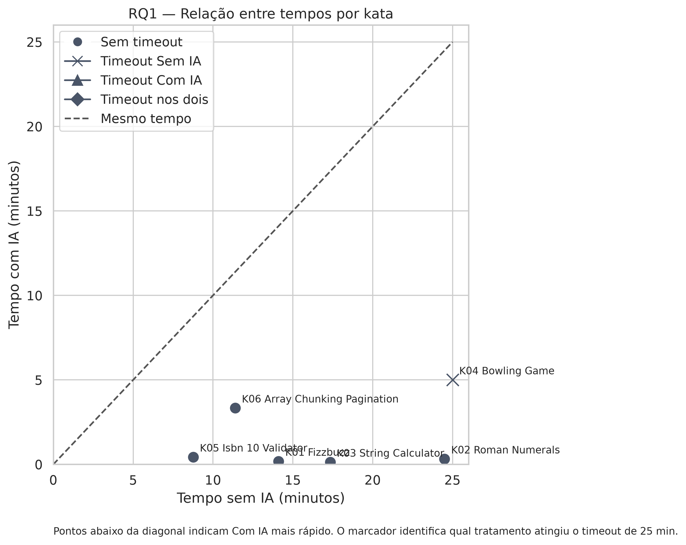
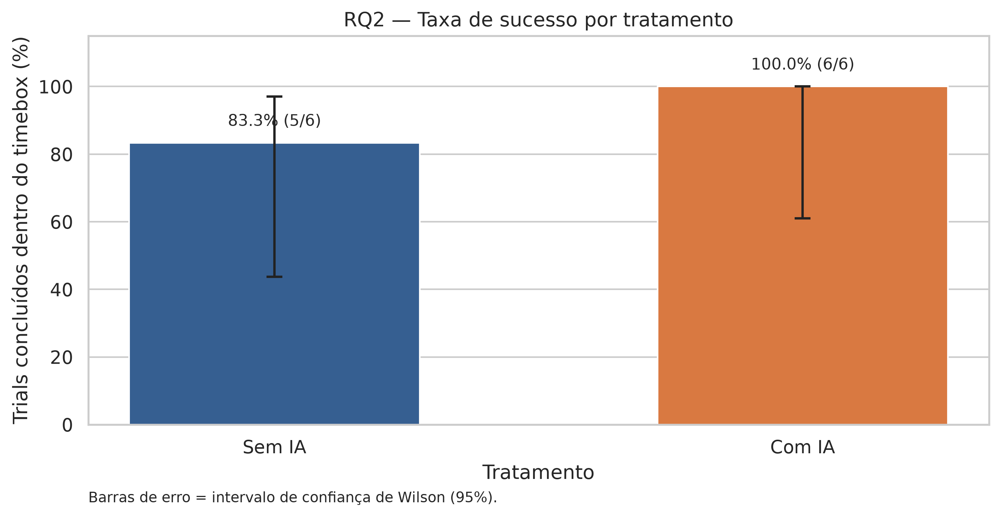
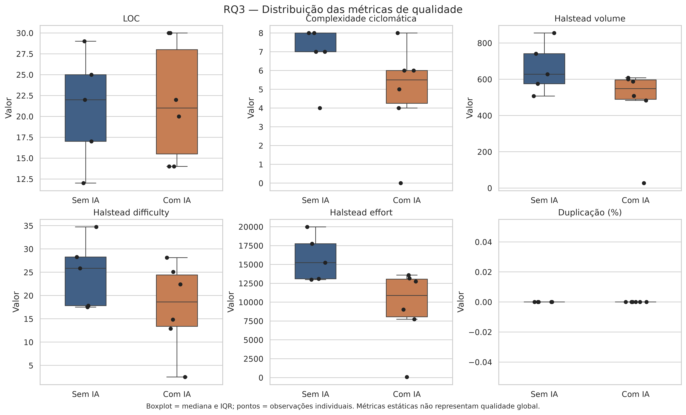
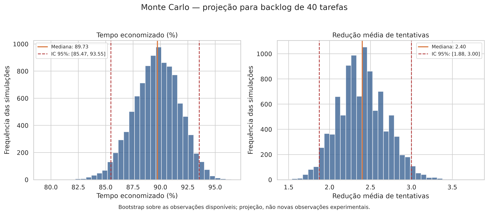

# Assistentes de IA versus Codificação Manual

## Experimento com Katas JavaScript

**Grupo:** Luísa Oliveira Jardim · Bernardo Souza Alvim · Pedro Augusto Santos Seabra  
**Disciplina:** Laboratório de Experimentação de Software  
**Professor:** Danilo Maia  
**Repositório:** [Lab-Experimentacao-e-Medicao-](https://github.com/luisajardim/Lab-Experimentacao-e-Medicao-)

---

# 1. Desenho do experimento

O objetivo foi comparar a resolução de seis katas JavaScript com e sem o auxílio de um assistente de IA:

- FizzBuzz;
- Roman Numerals;
- String Calculator;
- Bowling Game;
- ISBN-10 Validator;
- Array Chunking & Pagination.

Cada execução utilizou uma suíte fixa de testes de aceitação e um timebox de 25 minutos. Foram registrados tempo até Green, número de tentativas, sucesso ou timeout e métricas estáticas do código.

Foram realizados **12 trials**:

- 6 com IA;
- 6 sem IA;
- todos os seis katas aparecem nos dois tratamentos;
- 11 trials terminaram com sucesso;
- 1 trial sem IA atingiu o timeout.

As três perguntas de pesquisa foram:

- **RQ1:** o uso de IA reduz o tempo necessário para atingir Green?
- **RQ2:** o uso de IA aumenta a taxa de sucesso dentro do timebox?
- **RQ3:** o código produzido com IA apresenta métricas estruturais equivalentes ou melhores?

---

# 2. Resultados de produtividade e sucesso

## RQ1 — Tempo até Green

A comparação foi feita por kata. No scatter, o eixo X representa o tempo sem IA e o eixo Y representa o tempo com IA. Pontos abaixo da diagonal indicam que o tratamento com IA foi mais rápido.

Nos seis katas observados, os pontos ficaram abaixo da diagonal. A mediana do tempo foi:

| Tratamento | Mediana |
| :--- | ---: |
| **Com IA** | 22,5 segundos |
| **Sem IA** | 846,5 segundos |

O resultado indica uma vantagem expressiva do tratamento com IA dentro do experimento. Como os tempos com IA foram muito baixos, eles devem ser interpretados junto às condições de coleta e às estratégias utilizadas durante os trials.

## RQ2 — Taxa de sucesso

A taxa de sucesso representa a proporção de trials que atingiram Green dentro do timebox. As barras de erro mostram intervalos de confiança de Wilson de 95%.

| Tratamento | Sucessos | Taxa |
| :--- | ---: | ---: |
| **Com IA** | 6/6 | **100%** |
| **Sem IA** | 5/6 | **83,3%** |

Além da taxa de sucesso maior, os trials com IA utilizaram mediana de **1 tentativa**, enquanto os trials sem IA utilizaram mediana de **3 tentativas** entre os casos concluídos.

---

# 3. Qualidade estrutural e projeção

## RQ3 — Métricas do código

Foram analisadas linhas de código, complexidade ciclomática, métricas de Halstead e duplicação. O gráfico mostra os pontos individuais e os boxplots por tratamento.

Os resultados indicam que o código com IA não apresentou aumento sistemático de complexidade ou duplicação. Em várias métricas, as medianas do tratamento com IA ficaram abaixo ou próximas às medianas do tratamento manual.

Essas métricas representam características estruturais do código. Elas não substituem a avaliação de correção, legibilidade ou manutenibilidade, mas ajudam a verificar se o ganho de produtividade veio acompanhado de maior complexidade.

## Projeção Monte Carlo

A análise Monte Carlo reamostrou os resultados observados em 10.000 simulações para um backlog hipotético de 40 tarefas. Ela não representa novas execuções: é uma projeção exploratória baseada nos dados coletados.

A projeção apresentou:

- mediana de **89,7% de tempo economizado**;
- intervalo de 95% entre **85,5% e 93,5%**;
- redução mediana de **2,4 tentativas por tarefa**;
- intervalo de 95% entre **1,88 e 3,00 tentativas**.

---

# Síntese final

Dentro das condições deste experimento, o tratamento com IA apresentou:

- menor tempo observado nos seis katas;
- maior taxa de sucesso;
- menor número de tentativas até Green;
- métricas estruturais geralmente equivalentes ou menores.

Os resultados apoiam a hipótese de que um assistente de IA pode acelerar a resolução de tarefas sem aumentar automaticamente a complexidade do código produzido.

A conclusão é válida para o conjunto de katas, participantes e regras analisados. Uma amostra maior permitiria avaliar melhor a generalização dos resultados e investigar como diferentes estratégias de uso da IA influenciam o desempenho.

## Mensagem principal

> **Neste experimento, a IA acelerou a resolução dos katas, aumentou a taxa de sucesso e não apresentou aumento sistemático nas métricas estruturais do código.**
