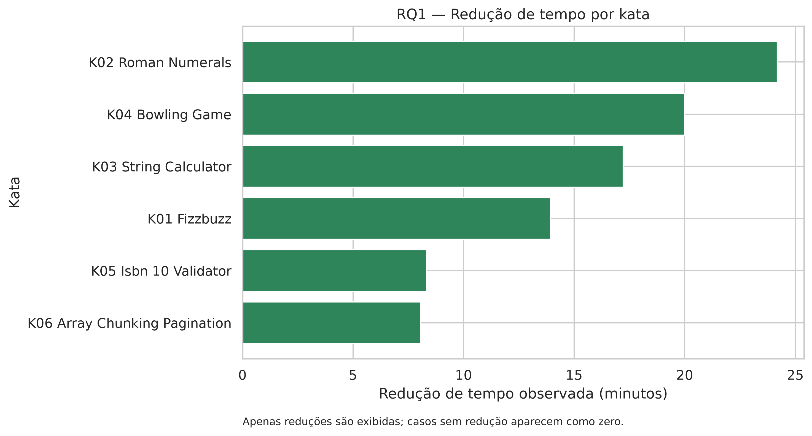
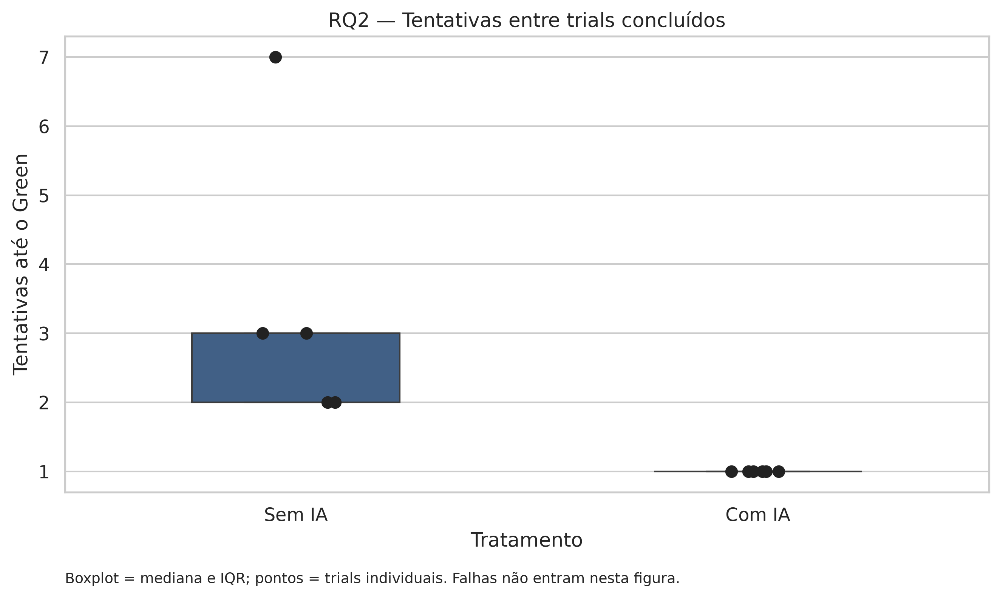
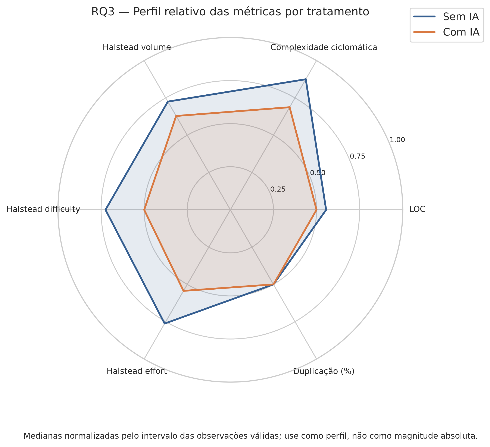
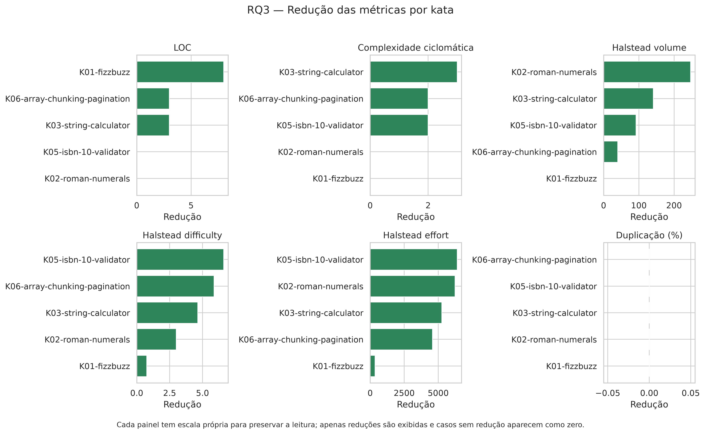

# Relatório de Laboratório

**Laboratório de Experimentação de Software — Lab02**

| Campo | Informação |
| :--- | :--- |
| **Curso** | Engenharia de Software |
| **Disciplina** | Laboratório de Experimentação de Software |
| **Turno / Período** | Noite / 6º período |
| **Professor** | Danilo Maia |
| **Laboratório** | Lab02 — Assistentes de IA versus codificação manual |
| **Grupo** | Luísa Oliveira Jardim · Bernardo Souza Alvim · Pedro Augusto Santos Seabra |
| **Repositório** | [Lab-Experimentacao-e-Medicao-](https://github.com/luisajardim/Lab-Experimentacao-e-Medicao-) |
| **Data de entrega** | 24/09/2026 |

## 1. Introdução

Ferramentas de IA generativa passaram a fazer parte do desenvolvimento de software, mas relatos de produtividade não são suficientes para estabelecer efeitos confiáveis. Este laboratório investiga, em condições controladas, a diferença entre resolver katas de programação manualmente e resolvê-los com auxílio de um assistente de IA.

O objeto de estudo foi a resolução de seis katas JavaScript por estudantes de graduação, usando uma suíte de testes de aceitação fixa e um timebox de 25 minutos. O experimento comparou os tratamentos `SEM_IA` e `COM_IA`.

### Questões de pesquisa

- **RQ1:** O uso de IA reduz o tempo necessário para atingir o estado Green?
- **RQ2:** O uso de IA aumenta a probabilidade de concluir o kata dentro do timebox?
- **RQ3:** O código produzido com IA apresenta métricas estruturais equivalentes ou melhores que o código produzido manualmente?

As hipóteses informais eram que a IA reduziria o tempo e o número de tentativas, aumentaria a taxa de sucesso e produziria código com complexidade e duplicação não maiores que o código manual.

Como contribuição adicional, o grupo implementou uma análise de projeção por bootstrap Monte Carlo para estimar a variabilidade de possíveis ganhos em um backlog de 40 tarefas. Essa projeção é exploratória e não substitui novas observações experimentais.

## 2. Contexto

O laboratório faz parte da sequência de experimentação de software da disciplina. O Lab02 aplica conceitos de GQM, desenho experimental, coleta automatizada, estatística descritiva, testes não paramétricos e visualização de dados.

O estudo utiliza seis katas JavaScript:

- FizzBuzz;
- Roman Numerals;
- String Calculator;
- Bowling Game;
- ISBN-10 Validator;
- Array Chunking & Pagination.

Os quatro primeiros representam desafios clássicos de programação e TDD. ISBN-10 Validator e Array Chunking & Pagination representam tarefas práticas de validação, parsing e manipulação de índices.

O desenho adotado combinou duas estratégias complementares. Luísa realizou todos os katas com IA, Bernardo realizou todos os katas sem IA, e Pedro realizou dois katas com IA e dois sem IA, conforme a divisão planejada pelo grupo. Essa organização permitiu controlar dois aspectos relevantes: a consistência do estilo de uso da IA no tratamento `COM_IA` e a consistência da experiência em programação competitiva no tratamento `SEM_IA`. Ao mesmo tempo, o terceiro participante forneceu uma parcela de comparação no formato crossover previsto originalmente.

Assim, existe paridade de cobertura entre os tratamentos: todos os seis katas foram executados com e sem IA por pelo menos um participante, e houve também participação cruzada de um desenvolvedor nos dois tratamentos. As comparações devem ser interpretadas como evidência exploratória do experimento, considerando que a amostra é pequena e que a distribuição de participantes por tratamento não é perfeitamente balanceada.

## 3. Metodologia

### 3.1 Principais desafios

Os principais desafios foram:

1. manter os katas e a suíte de testes constantes entre os tratamentos;
2. limitar a interação da IA ao enunciado do kata, sem fornecer a suíte de testes;
3. registrar tempo, tentativas, sucesso e timeout de forma automatizada;
4. lidar com uma amostra pequena, na qual médias e distribuições suavizadas podem induzir interpretações exageradas;
5. comparar métricas de qualidade entre katas de naturezas diferentes;
6. identificar e tratar o trial `Bowling Game` sem IA que atingiu o timeout;
7. manter a rastreabilidade das soluções e dos prompts utilizados no tratamento com IA.

### 3.2 Tomadas de decisão

O tratamento `COM_IA` utilizou um assistente de IA padronizado, com acesso apenas ao texto do enunciado. As interações foram registradas em `prompts.md` nas pastas dos trials com IA. A decisão de concentrar os trials com IA em um participante teve como objetivo reduzir a variação entre estratégias de prompting, enquanto a concentração dos trials sem IA em um participante com maior experiência em programação competitiva buscou estabelecer uma referência manual consistente. Essa escolha melhora a consistência interna de cada tratamento, embora limite a generalização para desenvolvedores com perfis diferentes.

O tempo primário foi definido como o intervalo entre o início do trial e o primeiro momento em que a suíte de aceitação passou. Trials que atingiram o timebox foram mantidos na análise de sucesso e representados como timeout nos gráficos de tempo.

Para RQ1 e RQ2 foram utilizadas as seguintes políticas:

- tempo: `duration_seconds / 60`;
- sucesso: campo booleano `success`;
- timeout: campo booleano `timeout`;
- tentativas: `test_attempts`, analisado apenas entre trials que atingiram Green;
- taxa de sucesso: sucessos divididos pelo total de trials do tratamento;
- comparação por kata: todos os katas aparecem nos dois tratamentos, permitindo verificar se o padrão se repete em tarefas de naturezas distintas;
- componente crossover: um dos participantes executou dois katas com IA e dois sem IA, fornecendo uma comparação adicional dentro do próprio perfil de desenvolvedor.

Para RQ3 foram utilizadas as métricas extraídas pelo `metrics-runner.js`. O trial manual de Bowling que sofreu timeout foi excluído dos gráficos de qualidade, pois seu artefato não representa uma solução concluída comparável. Assim, os gráficos de RQ3 usam 11 artefatos válidos: 6 `COM_IA` e 5 `SEM_IA`.

### 3.3 Etapas

| Sprint | Entregas | Responsáveis | Issues |
| :--- | :--- | :--- | :--- |
| **S01** | Definição dos katas, suíte de testes, regras experimentais e ferramentas de execução | Grupo | Issues do planejamento |
| **S02** | Execução dos trials com e sem IA, registro dos tempos, tentativas e prompts | Luísa, Bernardo e Pedro | Issues de execução |
| **S03** | Runner de métricas, análise estatística, gráficos e consolidação dos resultados | Grupo | Issues de análise |
| **Relatório final** | Interpretação dos resultados, ameaças à validade e recomendações | Grupo | Issue de entrega |

O fluxo de trabalho foi acompanhado pelo GitHub Projects. A configuração do board não foi incluída neste relatório por não haver uma captura exportada junto aos artefatos do experimento.

### 3.4 Ferramentas

- JavaScript e Node.js para implementação dos katas;
- Jest para execução da suíte de aceitação;
- `timer-cli.js` para controle do timebox e registro dos trials;
- `metrics-runner.js` para métricas estáticas;
- `escomplex` para complexidade e métricas de Halstead;
- `jscpd` para duplicação de código;
- Python 3.10 ou superior;
- pandas e NumPy para manipulação dos dados;
- SciPy para testes estatísticos;
- Matplotlib e Seaborn para visualização;
- Git e GitHub Projects para rastreabilidade do processo.

### 3.5 Tabela de métricas

| RQ | Métrica | Definição operacional | Unidade | Fonte |
| :--- | :--- | :--- | :--- | :--- |
| **RQ1** | Time-to-Green | `end_time - start_time` no primeiro sucesso da suíte | segundos/minutos | `trials-log.json` e `timer-cli.js` |
| **RQ1** | Timeout | Trial que alcança o limite sem sucesso | booleano | `trials-log.json` |
| **RQ2** | Taxa de sucesso | `número de trials com success=true / número total de trials` | proporção/% | `trials-log.json` |
| **RQ2** | Tentativas até Green | Valor de `test_attempts` nos trials concluídos | contagem | `trials-log.json` |
| **RQ3** | LOC | Linhas de código medidas no artefato final | linhas | `metrics.json` |
| **RQ3** | Complexidade ciclomática | Complexidade calculada pelo analisador estático | índice | `metrics.json` |
| **RQ3** | Halstead volume | Volume de operadores e operandos do programa | índice | `metrics.json` |
| **RQ3** | Halstead difficulty | Dificuldade estimada pela métrica de Halstead | índice | `metrics.json` |
| **RQ3** | Halstead effort | Produto de volume e dificuldade | índice | `metrics.json` |
| **RQ3** | Duplicação | Percentual de linhas duplicadas | % | `metrics.json` via jscpd |
| **Inovação** | Economia projetada | Distribuição bootstrap de `time_saved_pct` | % | `monte_carlo_simulations.csv` |

### 3.6 Inovações propostas pelo grupo

A principal inovação foi integrar a análise gráfica e a projeção Monte Carlo ao pipeline estatístico. O módulo modularizado em `analysis/charts/` carrega os artefatos dos demais scripts, normaliza os nomes dos katas, preserva timeouts e exporta figuras PNG e SVG em `analysis/output/charts/`.

A projeção Monte Carlo simula 10.000 amostras de um backlog de 40 tarefas, reamostrando os valores observados. Ela estima a distribuição da economia de tempo e da redução de tentativas. O resultado é usado apenas como análise exploratória, pois a simulação não aumenta o tamanho real da amostra.

## 4. Resultados

### 4.1 Coleta de dados

Foram registrados 12 trials, sendo 6 com IA e 6 sem IA. O período de coleta foi de 14 a 18 de setembro de 2026.

- `COM_IA`: 6 trials, 6 sucessos e nenhum timeout;
- `SEM_IA`: 6 trials, 5 sucessos e 1 timeout;
- total: 11 sucessos e 1 timeout;
- métricas estáticas: 12 artefatos encontrados, dos quais 11 foram considerados válidos para os gráficos de qualidade após a exclusão do artefato associado ao timeout;
- prompts registrados: 6 trials com IA.

Os tempos com IA foram muito baixos em alguns casos. A mediana observada foi de aproximadamente 22,5 segundos, enquanto a mediana sem IA foi de aproximadamente 846,5 segundos. Como não há informação suficiente sobre o momento exato em que cada participante iniciou a implementação após consultar a IA, esse resultado deve ser tratado como uma hipótese de viés de medição a ser investigada, e não como prova isolada de ganho de produtividade de aproximadamente 40 vezes.

### 4.2 Visualização gráfica

#### RQ1 — O uso de IA reduz o tempo necessário para atingir Green?

O scatter pareado relaciona o tempo sem IA no eixo X e o tempo com IA no eixo Y. A diagonal representa igualdade entre tratamentos. Pontos abaixo dela indicam menor tempo com IA. O marcador também identifica qual tratamento atingiu o timeout.

O gráfico mostra todos os seis katas, mas a interpretação causal é limitada porque os tratamentos não foram executados consistentemente pelos mesmos desenvolvedores. Além disso, o valor de aproximadamente 25 minutos no eixo sem IA corresponde ao timeout censurado do Bowling Game.

Como síntese categórica, o gráfico de barras ordena a redução observada por kata. Valores maiores indicam maior diferença favorável ao tratamento com IA.

Entre os trials bem-sucedidos, a mediana foi de 22,5 segundos com IA e 846,5 segundos sem IA. O teste de Mann-Whitney aplicado aos sucessos apresentou `p=0,0043` e Cliff's delta `-1,0`. Esse resultado é compatível com uma vantagem expressiva do tratamento com IA no conjunto observado, devendo ser interpretado junto à divisão intencional dos participantes, ao n pequeno e à necessidade de auditar o registro dos tempos com IA. O teste de Wilcoxon disponível no artefato estatístico foi calculado com apenas três pares, devido ao catálogo de katas usado naquela execução, e apresentou `p=0,25`.

#### RQ2 — O uso de IA aumenta a taxa de sucesso?

O gráfico de barras compara a proporção de trials que terminaram dentro do timebox. As barras de erro representam intervalos de confiança de Wilson de 95%, e os rótulos exibem a contagem bruta.

A taxa de sucesso foi de 100% (`6/6`) com IA e 83,3% (`5/6`) sem IA. A diferença observada favorece o tratamento com IA, mas os intervalos são largos e se sobrepõem, o que é esperado em uma amostra tão pequena.

O boxplot complementado por pontos mostra as tentativas até Green entre os trials concluídos. O tratamento com IA teve mediana de 1 tentativa e IQR igual a zero. O tratamento sem IA teve mediana de 3 tentativas e IQR de 1 tentativa.

O resultado descritivo favorece a IA e reforça a hipótese do estudo. A generalização para outras tarefas ou desenvolvedores exige uma amostra ampliada, mas o efeito observado é relevante dentro do conjunto de katas e participantes analisado.

#### RQ3 — O código com IA apresenta métricas estruturais equivalentes ou melhores?

A grade de boxplots apresenta LOC, complexidade ciclomática, métricas de Halstead e duplicação. Os pontos individuais permanecem visíveis para evitar que o leitor interprete uma distribuição baseada em apenas cinco ou seis observações como uma população grande.

O perfil radar resume as medianas normalizadas das métricas. A normalização é feita pelo intervalo de observações disponíveis e serve apenas para comparação de perfil, não para comparar diretamente as magnitudes entre métricas diferentes.

Como síntese, os pequenos múltiplos abaixo mostram a redução observada por métrica e por kata. Cada painel tem escala própria porque LOC e Halstead effort possuem ordens de grandeza diferentes.

Nos artefatos válidos, os valores medianos sugerem menor complexidade ciclomática e menor esforço de Halstead no tratamento com IA. Entretanto, duplicação ficou em zero na mediana dos dois tratamentos e as diferenças não devem ser interpretadas como qualidade global. As métricas são indicadores estruturais, não substitutos de revisão, legibilidade, correção ou manutenibilidade.

#### Análise exploratória Monte Carlo

O histograma apresenta 10.000 reamostragens para um backlog hipotético de 40 tarefas. A mediana projetada de economia de tempo foi de aproximadamente 89,7%, com intervalo de 95% entre 85,5% e 93,5%. A redução projetada de tentativas teve mediana de 2,4, com intervalo de 95% entre 1,88 e 3,00.

Esses valores representam uma projeção baseada nos trials observados. Não são novas medições e herdam todos os vieses da amostra original, especialmente os tempos extremamente baixos registrados em alguns trials com IA.

### 4.3 Discussão

**RQ1.** A hipótese de redução de tempo foi observada de forma consistente nos seis katas. O tratamento com IA apresentou tempos menores em todos os pares observados, e a diferença aparece tanto no scatter quanto no gráfico de redução por kata. O resultado é relevante como evidência inicial de produtividade no contexto estudado. A interpretação deve continuar sendo exploratória, pois a amostra é pequena e os tempos muito baixos de alguns trials com IA merecem uma auditoria complementar da instrumentação.

**RQ2.** A taxa de sucesso favoreceu a IA, com 6 de 6 sucessos contra 5 de 6 sem IA. As tentativas também foram menores com IA entre os trials concluídos. A hipótese foi apoiada pelos resultados descritivos: além de não ocorrer timeout no tratamento com IA, todos os seus trials atingiram Green na primeira tentativa. Com uma amostra maior, seria possível estimar melhor a estabilidade desse padrão.

**RQ3.** Os gráficos indicam um perfil estrutural geralmente menor ou equivalente com IA em complexidade, volume e esforço. Esse resultado é compatível com a hipótese de que o auxílio da IA não aumentou a complexidade ou a duplicação dos artefatos produzidos. A conclusão é exploratória, pois cada kata possui uma observação por tratamento e as métricas estáticas representam apenas uma dimensão da qualidade do código.

As principais ameaças à validade são: tamanho amostral reduzido; distribuição intencional, mas não perfeitamente balanceada, dos participantes entre os tratamentos; diferenças de experiência entre participantes; dificuldade potencial desigual dos katas; necessidade de confirmar a instrumentação dos tempos com IA; uso de métricas estáticas como proxies de qualidade; e exclusão do timeout dos gráficos de qualidade, necessária para evitar comparar um artefato incompleto. Essas limitações reduzem a generalização dos resultados, mas não anulam a validade da comparação realizada dentro das condições definidas pelo grupo.

## 5. Conclusão

Neste experimento, o tratamento com IA apresentou menor tempo observado nos seis katas, maior taxa de sucesso e menor número de tentativas até Green. As métricas estruturais também indicaram código com complexidade, volume e esforço geralmente menores ou equivalentes aos observados no tratamento manual. Portanto, dentro do contexto experimental definido, os resultados apoiam a hipótese de que o assistente de IA pode acelerar a resolução de tarefas e manter um nível estrutural de qualidade comparável.

O grupo não afirma que a IA é universalmente melhor ou que os ganhos observados se repetirão em qualquer equipe. A conclusão adequada é mais específica: para os seis katas analisados, sob o timebox e as regras estabelecidas, o tratamento com IA apresentou desempenho favorável em tempo, sucesso e tentativas. A cobertura dos seis katas nos dois tratamentos e a divisão planejada entre os participantes tornam a comparação válida como estudo exploratório, enquanto a amostra reduzida recomenda confirmar os achados em uma rodada maior.

O experimento também entregou uma infraestrutura reprodutível de coleta, métricas estáticas, análise não paramétrica, gráficos adequados para amostras pequenas e uma projeção Monte Carlo. Como continuidade, o grupo pode ampliar o número de participantes, repetir os katas em ordem contrabalanceada, auditar o cronômetro e registrar as estratégias de prompting. Essas extensões aprofundariam um resultado inicial promissor sem retirar o mérito do experimento realizado.

## 6. Referências

- BASILI, V. R.; CALDIERA, G.; ROMBACH, H. D. The Goal Question Metric approach.
- FORSGREN, N.; HUMBLE, J.; KIM, G. *Accelerate*. IT Revolution Press, 2018.
- WOHLIN, C. et al. *Experimentation in Software Engineering*. Springer, 2012.
- ZUSE, H. *A Framework of Software Measurement*. Walter de Gruyter, 2013.
- Documentação do Jest: https://jestjs.io/
- Documentação do pandas: https://pandas.pydata.org/
- Documentação do SciPy: https://scipy.org/
- Documentação do Matplotlib: https://matplotlib.org/
- Documentação do Seaborn: https://seaborn.pydata.org/
- Repositório do experimento: https://github.com/luisajardim/Lab-Experimentacao-e-Medicao-
